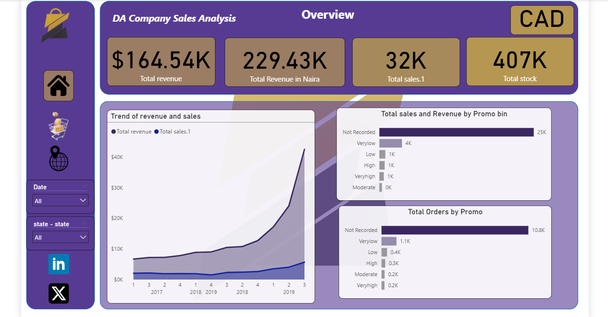
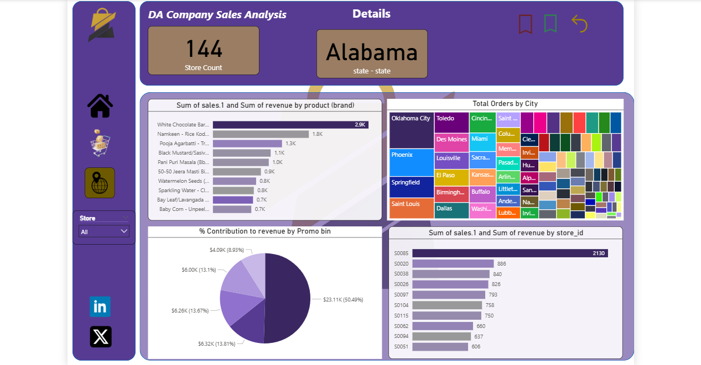
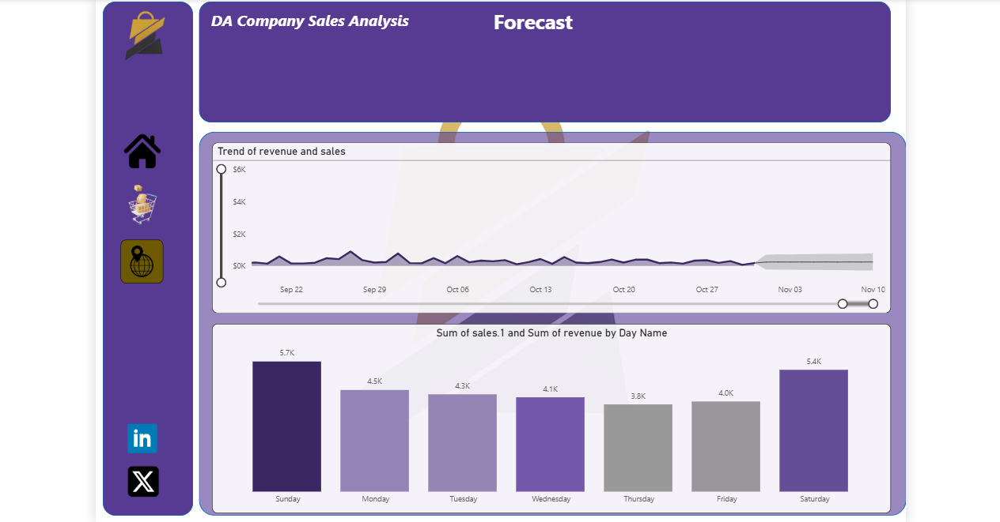

# 🛒 Company Sales Analysis — Power BI

A multi-page Power BI dashboard analyzing retail sales performance across 
products, locations, promotions, and revenue forecasting.

---

## 🛠️ Tools Used
- Power BI Desktop

## 📂 Data Source
Dataset obtained from [Kaggle](https://www.kaggle.com)

## 💡 Key Insights
- Total revenue of $164.54K (229.43K in Naira) across 32K total sales
- Texas leads in total sales with 4,013 orders and $21,418 in revenue
- Snacks & Branded Foods is the top performing category with 11.7K sales
- White Chocolate Bar is the best selling product by brand
- Sunday and Saturday are the highest revenue days of the week
- Revenue grew sharply from 2017 through mid-2019

---

## 📸 Screenshots

### Overview

*Total revenue, sales trends over time and sales distribution by promotion level.*

### Details

*Store count, top products by brand, revenue contribution by promo and orders by city.*

### Forecast

*Revenue and sales trend forecast with daily breakdown showing peak days.*

### Location Analysis

*State-level revenue, sales and stock breakdown with store size vs revenue relationship.*

### Product Analysis

*Sales and revenue across 444 unique products, 10 categories and top performing brands.*

---

**Daniel Agbaso** — Data Analyst | Power BI

 
